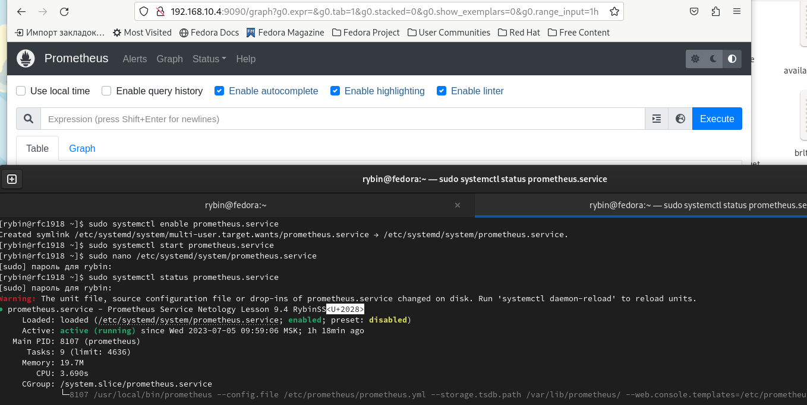
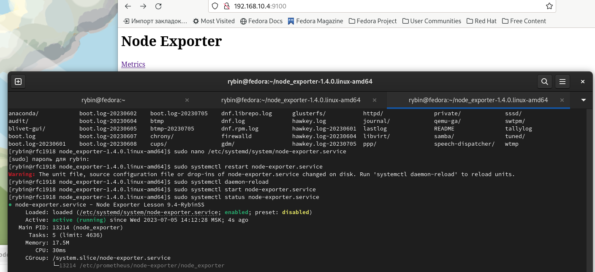
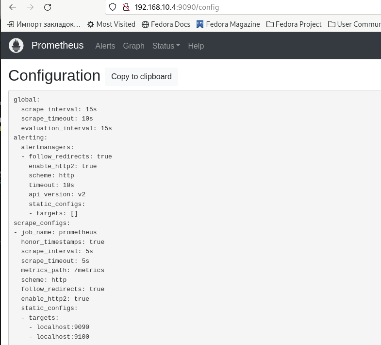
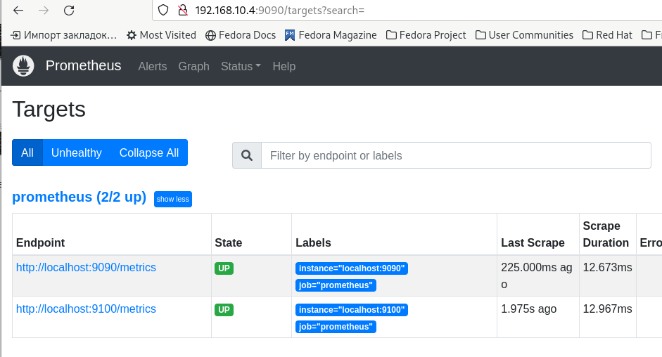
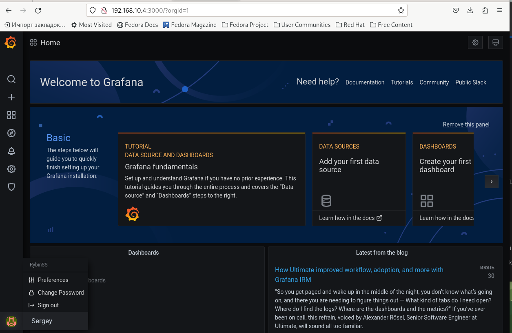
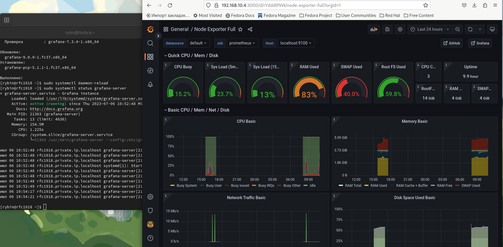

# prometheus_hw_1
Домашнее задание к занятию "`Git`" - `Рыбин Сергей Сергеевич`

### Задание 1

`Установите Prometheus.`

1.  Создайте пользователя prometheus.  

2.  Скачайте prometheus и в соответствии с лекцией разместите файлы в целевые директории  

3.  Создайте сервис как показано на уроке.  

4.  Проверьте что prometheus запускается, останавливается, перезапускается и отображает статус с помощью systemctl.  
  
---

### Задание 2

`Установите Node Exporter.`

1. Скачайте node exporter приведённый в презентации и в соответствии с лекцией разместите файлы в целевые директории.  
2. Создайте сервис для как показано на уроке.  
3. Проверьте что node exporter запускается, останавливается, перезапускается и отображает статус с помощью systemctl.  
  
---

### Задание 3

`Подключите Node Exporter к серверу Prometheus.`

1. Отредактируйте prometheus.yaml, добавив в массив таргетов установленный в задании 2 node exporter.  
2. Перезапустите prometheus.  
3. Проверьте что он запустился.  
  
  
---

### Задание 4

`Установите Grafana.`

1. Прикрепите к файлу README.md скриншот левого нижнего угла интерфейса, чтобы при наведении на иконку пользователя были видны ваши ФИО  
  
---

### Задание 5

`Интегрируйте Grafana и Prometheus.`

1. Прикрепите к файлу README.md скриншот дашборда (ID:11074) с поступающими туда данными из Node Exporter  
  
---
